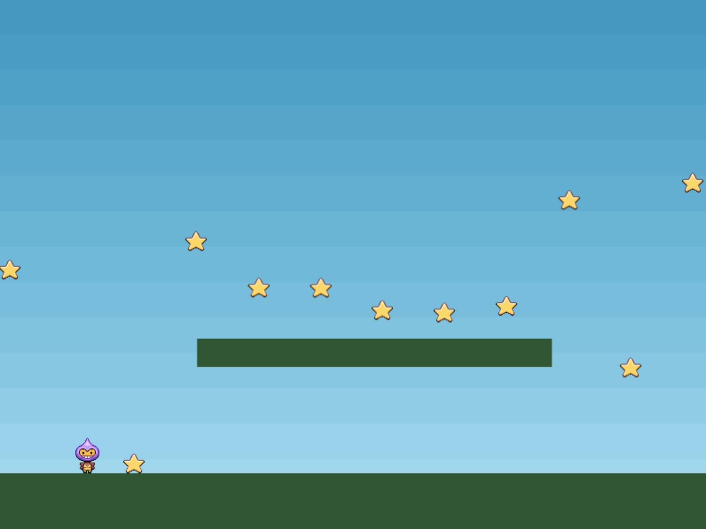

# Phaser3 TypeScript webpack
WIP



# About

## Original Code
This game codes and assets from [phaser.io](https://phaser.io/) (JavaScript)

- [Example Demo Page](https://phaser.io/examples/v3/view/physics/arcade/basic-platform)
- [GitHub Code](https://github.com/photonstorm/phaser3-examples/blob/master/public/src/physics/arcade/basic%20platform.js)

## Packages
- `Phaser 3.23`
- `TypeScript 3.9`
- `webpack 4.43`
    - `babel-loader`
        - `@babel/preset-env` ... See [@babel/preset-env](https://babeljs.io/docs/en/next/babel-preset-env.html)
        - `@babel/preset-typescript` ... Babel preset for TypeScript.
    - `html-webpack-plugin` ... Render HTML for webpack bundle hash
    - `sass-loader` ... Parse scss
    - `mini-css-extract-plugin` ... Extract css
- `ESLint 7.4`

# Development
## Requirements
- Node.js

## Setup
```
npm install
```

## Build
### Build bundle
```
npm run build
```

## Build and watch
```
npm run dev
```

# Directory Structure
